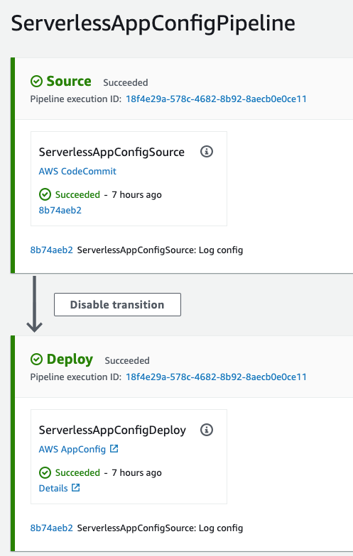

# aws-appconfig-codepipeline-cdk

This sample application demos setup of [AWS AppConfig](https://docs.aws.amazon.com/appconfig/latest/userguide/what-is-appconfig.html) using [AWS CDK](https://aws.amazon.com/cdk/). AWS AppConfig appliction is 
set up to use [AWS CodePipeline](https://aws.amazon.com/codepipeline/) as [configuration store](https://docs.aws.amazon.com/appconfig/latest/userguide/appconfig-creating-configuration-and-profile.html). It also sets up [AWS Lambda validator](https://docs.aws.amazon.com/appconfig/latest/userguide/appconfig-creating-configuration-and-profile-validators.html) to validate 
the configuration.

In addition, the project can set up a basic serverless api using [Amazon API Gateway](https://docs.aws.amazon.com/apigateway/latest/developerguide/apigateway-rest-api.html)
backed by [AWS Lambda](https://aws.amazon.com/lambda/) which makes use of [AWS AppConfig Lambda extension](https://docs.aws.amazon.com/appconfig/latest/userguide/appconfig-integration-lambda-extensions.html) to query hosted configuration.

[Kotlin](https://kotlinlang.org/) is used as language runtime to set up both the cdk application and needed lambda functions. 

## Project structure

    ├── infrastructure          # Infrastructure code vi CDK(Kotlin) for AppConfig setup.
    ├── software                # Holds business logic in AWS lambda functions
    │   ├── configvalidator     # Lambda validator for app config configuration
    │   └── demofunction        # Sample function to using lambda extension to query app config configurations
    └── ...

## Prerequisite

- Make sure you have [AWS CDK](https://docs.aws.amazon.com/cdk/latest/guide/getting_started.html) installed and configured with an aws account you want to use.
- [git-remote-codecommit](https://github.com/aws/git-remote-codecommit#step-3-install-git-remote-codecommit)

# Getting started

## AppConfig with CodePipeline as Configuration Store

- Change directory to where infrastructure code lives.

```bash
    cd infrastructure
    cdk synth
```

- Deploy the CDK application stack named `AppConfigCiCdStack`. This stack will take care of setting up app config application named `ServerlessApplicationConfig` with 
a `Test` environment which will use codepipeline as configuration store. CodePipeline is also created using a codecommit repository as a source for configurations. 

```bash
    cdk deploy --app 'cdk.out/' AppConfigCiCdStack
```

Above command will take care of packaging the `configvalidator` lambda function as well. Acknowledge security related changes 
prompt during deployment process. Once completed AppConfig related details are provided as stack output. 

- Once the stack is successfully deployed, You can navigate to your aws account and see the created 
[codepipeline project](https://console.aws.amazon.com/codesuite/codepipeline/pipelines/ServerlessAppConfigPipeline/view?region=eu-west-1) along with an empty code commit repo.
You need to clone the newly created codecommit repo to push a [sample config file](infrastructure/src/main/resources/asset/logging.yaml).

```bash
    git clone codecommit://serverless-app-configurations && cd serverless-app-configurations/
```

- Commit [sample config file](infrastructure/src/main/resources/asset/logging.yaml) into the repo.

```bash
  git add .
  git commit -m "Log config"
```

Now the codepipeline should trigger automatically and deploy the configuration. It will also invoke the [validator handler](software/configvalidator/src/main/kotlin/com/app/config/ValidatorHandler.kt)
to validate the configurations.





## Deploy Sample Serverless Application with AppConfig Lambda Extension

- Deploy `ServerlessAppStack`. Acknowledge security related changes prompt during deployment process.

```bash
  cdk deploy --app 'cdk.out/' ServerlessAppStack
```

Serverless Api Path is provided as stack output. 

- Validate the api response.

```bash
 curl https://<hash>.execute-api.eu-west-1.amazonaws.com/prod/
```

This will return api gateway proxy request itself as response. But let's see app config in action.

```bash
 curl https://<hash>.execute-api.eu-west-1.amazonaws.com/prod/?appConfig=true
```

This will return the app config configuration which was committed to code commit repository.  

- Now try changing the log level value in the codecommit repo `logging.yaml` file. Once the config is deployed via codepipeline,
try accessing the same api url again. You should be able to see the latest config value in the response.

```bash
 curl https://<hash>.execute-api.eu-west-1.amazonaws.com/prod/?appConfig=true
```


## Cleanup

```bash
    cdk destroy ServerlessAppStack
    cdk destroy AppConfigCiCdStack
```

Acknowledge stack deletion when prompted.


## Useful commands

* `mvn package`     compile and run tests
* `cdk ls`          list all stacks in the app
* `cdk synth`       emits the synthesized CloudFormation template
* `cdk deploy`      deploy this stack to your default AWS account/region
* `cdk diff`        compare deployed stack with current state
* `cdk docs`        open CDK documentation

Enjoy!

## Security

See [CONTRIBUTING](CONTRIBUTING.md#security-issue-notifications) for more information.

## License

This library is licensed under the MIT-0 License. See the LICENSE file.